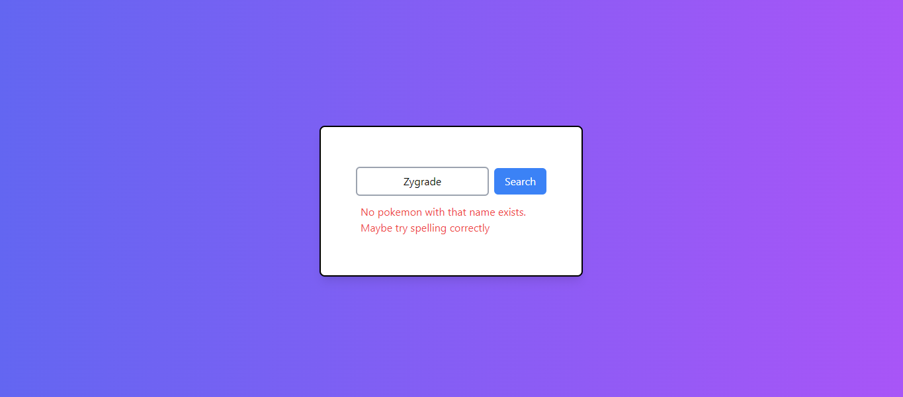

# PokemonSearch-Basic-Version
### This project is for educational purposes.

## Project Description:
This is a webpage that can be used to find a Pokémon's name. The data is not hardcoded. The data is fetched using an API.

## Dependencies used for the project:
- Vite
- Tailwind CSS
- PostCSS
- Autoprefixer

### To view this project after cloning:
1. Install the dependencies:
   ```sh
   npm create vite@latest
   npm init
   npm init -y
   npm install -D tailwindcss postcss autoprefixer
   npx tailwindcss init -p
   
2.Change the tailwind.config.js file to include the paths to your content files: 
   ```sh   
   module.exports = {
     content: ["./src/**/*.{html,js}"],
     theme: {
       extend: {},
     },
     plugins: [],
   };

3.Create a CSS file for Tailwind in src/styles/tailwind.css:
   @tailwind base;
   @tailwind components;
   @tailwind utilities;

4.Build the Tailwind CSS:
   Add a script to your package.json:
   "scripts": {
  "build:css": "npx tailwindcss -i ./src/styles/tailwind.css -o ./public/output.css --watch"
}

<div style="text-align:center">
  <h1>UI of THE WEBPAGE</h1>
  
</div>
<div>
  <h1>Searching</h1>
  
  <p style="text-align:justify">The text entered is automatically aligned and centered for clean look purposes.</p>
</div>
<div>
  <h1>Error Handling</h1>
  
  <p style="text-align:justify">Shows an error message when the entered data is wrong.</p>
</div>
<div>
  <h1>Loading</h1>
  
  <p style="text-align:justify">A loading icon animation is shown while the data is being fetched.</p>
</div>
<div>
  <h1>Data Displaying</h1>
  
  
  <p style="text-align:justify">The data of the Pokémon along with its picture and stats are shown.</p>
</div>
